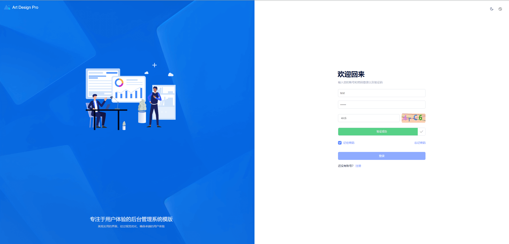
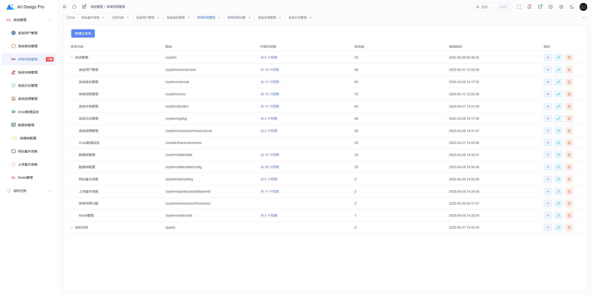
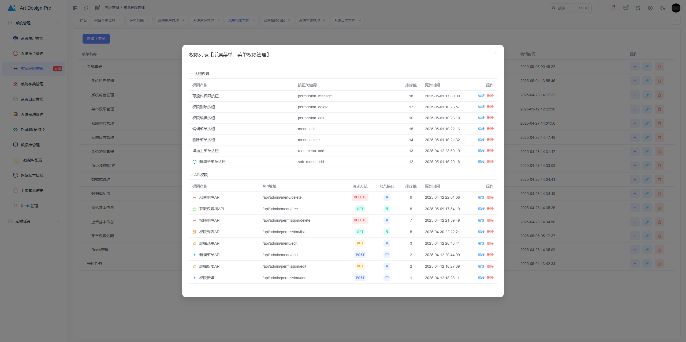
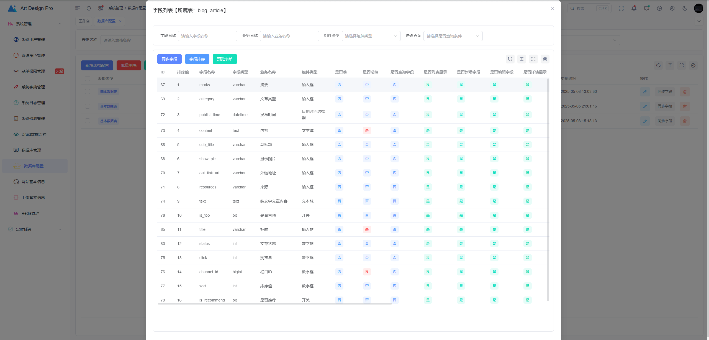
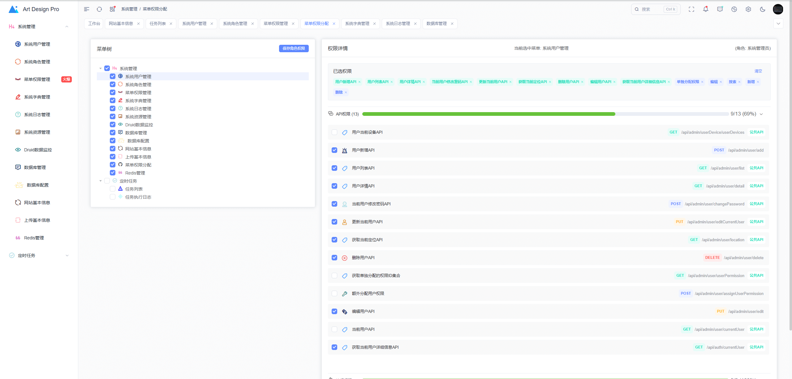

# mysiteforme 权限管理系统

**mysiteforme** 是一个基于 Spring Boot 开发的轻量级系统脚手架，旨在帮助开发者快速搭建属于自己的系统后台。系统集成了用户管理、角色管理、权限管理、资源管理、数据库管理、代码生成等功能，适合作为中小型项目的基础框架。

**项目特点：**

*   **技术栈新颖**: 后端采用 Spring Boot 3.2.5、Spring Security (或 Sa-Token)、MyBatis Plus；前端采用 Vue 3.x、Vite、Element Plus、Pinia。
*   **前后端分离**: 清晰的架构，方便独立部署和开发。
*   **权限控制**: 内置基于 RBAC (Role-Based Access Control) 的权限模型，支持菜单权限和按钮级别权限。
*   **代码简洁**: 结构清晰，易于理解和二次开发。
*   **界面美观**: 基于 Element Plus，提供清爽友好的用户界面。
*   **快速上手**: 提供详细的部署和运行指南。

## ✨ 特性 (Features)

*   **用户管理**: 用户新增、编辑、删除、查询、状态管理等。
*   **角色管理**: 角色配置，为角色分配菜单和操作权限。
*   **菜单管理**: 配置系统导航菜单，支持多级菜单。
*   **权限控制**: 精确到按钮级别的权限控制。
*   **登录认证**: 基于 JWT Token 的认证机制。
*   **操作日志**: 记录用户关键操作。
*   **字典管理**: 维护系统中常用的静态数据。
*   **国际化**: 前后端固定文字内容均已实现国际化。
*   **Docker Compose支持**: 提供 Docker Compose一键部署方案。
## 线上体验 (Online Demo)

*   **演示地址**: [https://admin.mysiteforme.com](https://admin.mysiteforme.com)
*   **账号密码**: 自主邮箱注册

## 🛠️ 技术栈 (Tech Stack)
- **后端**：
    - Spring Boot 3.2.5：快速构建独立运行的 Java 应用。
    - Spring Security 6.2.4：权限管理框架，支持认证和授权。
    - MyBatis Plus 3.5.10.1：简化 MyBatis 操作，提升开发效率。
    - Quartz：任务调度框架，用于定时任务管理。
    - Redis：高性能的缓存数据库。
    - Druid 1.2.20：数据库连接池，支持监控和 SQL 优化。
    - JDK 17：Java 版本。
    - MySQL 8.0.32：关系型数据库。
    - Maven 17.0.14：项目构建和依赖管理。
- **前端**：
    - [Art-design-pro](https://github.com/Daymychen/art-design-pro)：轻量级开源VUE3后台框架，基于 Vue3、TypeScript、Vite 和 Element-Plus 精心打造的后台管理系统模板。

## 快速体验
按以下步骤即可快速启动项目：
### 后端启动
1. **环境准备(docker启动可忽略)**：
    - JDK >= `17`。
    - MySQL >= `8.0.32`。
    - Redis >= `7.2.1`。
    - Maven >= `17.0.14`。
    - Node.js >= `22.14.0`。
2. **导入数据库**：
    - 将根目录下的 `db` 文件夹中的 `01_new_mysiteforme.sql`, `02_update.sql` 文件依次导入到 MySQL 数据库中。
3. **修改配置文件**：
    - 根据实际环境修改 `application.yml` 中的数据库和 Redis 配置。
4. **运行项目**：
    - 使用 IDE 或命令行运行项目的主类 `com.mysiteforme.Application`。
### 前段启动
1. **环境准备**：
   - Node.js >= `22.14.0`。
   - 配置pnpm命令：`npm install -g pnpm`
2. **安装依赖**：
   - 使用 pnpm 安装依赖：`pnpm install`
   - 如果 pnpm install 安装失败，尝试使用下面的命令安装依赖：`pnpm install --ignore-scripts`
3. **启动项目**：
   - 本地启动：进入前段文件夹server-ui，执行命令：`pnpm dev`
   - 生产环境打包：`pnpm build`
### DOCKER启动
1. **环境准备**：
   - 安装 [Docker](https://docs.docker.com/get-docker/)
   - 安装 [Docker Compose](https://docs.docker.com/compose/install/)
2. **启动项目**：
   - ### 开发环境
    ```bash
    # --env-file 指定了要加载的环境变量文件
    # -f 指定了基础和覆盖的compose文件
    # --build 会强制重新构建镜像
    docker-compose -f docker-compose.yml -f docker-compose-dev.yml --env-file .env.dev up --build -d
    ```
   - ### 生产环境：
    ```bash
    # 确保 .env.prod 中的密码是安全的或通过其他方式注入
    docker-compose -f docker-compose.yml -f docker-compose-prod.yml --env-file .env.prod up --build -d
    ```
   - ### 停止和移除容器：
    ```bash
    # 开发环境
    docker-compose -f docker-compose.yml -f docker-compose-dev.yml --env-file .env.dev down
    # 生产环境
    docker-compose -f docker-compose.yml -f docker-compose-prod.yml --env-file .env.prod down
    # 移除volume (小心！会删除数据)
    # docker-compose ... down -v
    ```
### 用户登录
1. **访问地址**：http://localhost:3006/
2. **默认用户账号和密码**：`test`,`123456` (可进入个人中心自助修改密码)
3. **文件上传**：系统默认本地上传,可在线配置阿里云上传,七牛云上传。配置并测试成功后可在网站设置中进行无缝切换
4. **位置服务**：系统默认使用[太平洋网络IP查询定位IP地址](https://whois.pconline.com.cn/),也可以在网站设置中配置腾讯的[IP查询定位服务](https://lbs.qq.com/)
## 项目结构
```
├── docs/                 # 项目文档
├── server-admin/         # 后端项目
│   ├── src/                  # 源码
│   │    ├── main/             # 主程序
│   │    │   ├── java/         # Java 源码
│   │    │   ├── resources/    # 配置文件及静态资源
│   │    └── test/             # 测试代码
│   ├── Dockerfile             # 后端Dockerfile
│   └── pom.xml               # Maven 配置文件
├── proxy/                # nginx代理配置文件
├── server-ui/            # 前端项目
│   ├── src/                  # 源码
│   ├── Dev-Dockerfile        # 前端Dockerfile  
│   └── Prod-Dockerfile       # 前端Dockerfile  
│
├── docker-compose.yml    # Docker-compose 基础配置文件
├── docker-compose-dev.yml    # Docker-compose 开发配置文件
├── docker-compose-prod.yml    # Docker-compose 生产配置文件
└── README.md             # 项目说明文件
```

## 截图预览
### 系统登录

### 系统菜单

### 系统权限

### 数据表

### 权限分配


## 贡献指南
欢迎提交 Issue 或 Pull Request，为项目贡献代码或建议。

## 开源协议
本项目基于 [Apache License 2.0](https://www.apache.org/licenses/LICENSE-2.0) 协议开源，您可以自由使用、修改和分发。
